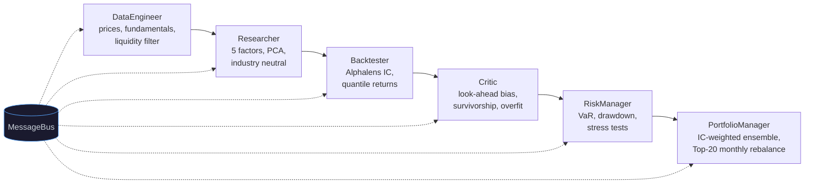

# Multi-Agent Quant Factor Platform

A multi-agent pipeline for US equity factor research and portfolio construction. Six autonomous agents collaborate through a shared message bus, each with a defined role, input contract, and output contract. The architecture mirrors LLM multi-agent systems: task decomposition, inter-agent communication, autonomous validation, and risk gating.

## Architecture



All agents communicate through a `MessageBus` (shared state store with pub/sub). The Orchestrator runs them sequentially and handles failure/reject logic.

## Key Results

Walk-forward backtest on Russell 1000, 2022-04 to 2024-12, Top-20 equal-weight monthly rebalance, 10bps/side transaction cost:

| Model | Sharpe | Ann. Return (net) | Max Drawdown | Total Cost |
|---|---|---|---|---|
| **IC-weighted linear** | **0.56** | **12.1%** | **-21.5%** | 4.6% |
| LightGBM LambdaRank | 0.44 | 13.7% | -26.9% | 6.2% |
| LightGBM Regression | 0.17 | 5.2% | -38.0% | 6.6% |

Cross-validation against Qlib: locked SP500 baseline reproduced within 0.02% (net annual return), confirming implementation correctness.

## Design Decisions

**Why multi-agent architecture.** Each agent has a single responsibility and a well-defined contract (input keys, output keys on the MessageBus). The Critic agent autonomously validates the pipeline for look-ahead bias, survivorship bias, and overfitting. The RiskManager gates the pipeline when drawdown or VaR exceeds thresholds. This is the same orchestration pattern used in LLM agent systems: task decomposition, tool use, and validation loops.

**Why IC-weighted linear beats LightGBM OOS.** Walk-forward ablation on Russell 1000 (24M train / 3M test, 8 folds) shows that simple IC-weighting achieves the best risk-adjusted return. LightGBM models have higher raw returns but worse Sharpe and significantly deeper drawdowns. On rolling factor data with limited cross-sectional signal, complex models overfit to noise in the training window. This is a deliberate finding, not a failure -- choosing the right tool matters more than defaulting to deep learning.

**Why PCA orthogonalization.** Raw factors (momentum, value, size, low-vol, reversal) have non-trivial correlations (e.g., size vs value ~0.4). PCA decorrelates them before IC-weighting, preventing double-counting of shared signal.

## Factors

| Factor | Definition | Rationale |
|---|---|---|
| Momentum (ret_2_12) | Cumulative 2-12M return, skip recent 1M | Price trend continuation |
| Value (B/P) | Book value / price, 2M lag | Mean reversion to fundamentals |
| Size (log mcap) | log(market cap), 2M lag | Small-cap premium |
| Low Volatility | -20D rolling std of returns | Low-risk anomaly |
| Reversal | -1M return | Short-term mean reversion |

Fundamental factors are lagged 2 months to mitigate look-ahead bias (simulating ~60-day reporting delay).

## Project Structure

```
agents/               # Multi-agent equity factor pipeline
factor_pipeline/       # Manual factor research protocol (S0–S7) + case files
    PIPELINE.md       # Shared checklist / pitfalls per stage
    README.md         # How to open a new factor case
    cases/            # e.g. F001 UVIX event calendar
dashboard/            # Macro risk + Alpha Deck (#factorlab) research hub
run.py                # Entry point (pipeline + optional Flask dashboard)
qlib_migration/       # Walk-forward LightGBM experiments, Qlib cross-validation
```

## Quick Start

```bash
git clone <repo-url> && cd quant
python -m venv .venv && source .venv/bin/activate
pip install -r requirements.txt

# Run full pipeline (downloads data, computes factors, backtests)
python run.py --no-frontend

# Run with live dashboard
python run.py
# Open http://localhost:8765
```

## Tech Stack

Python, yfinance, alphalens-reloaded, scikit-learn (PCA), pandas, numpy, matplotlib, Flask. LightGBM and Microsoft Qlib for the ablation study.
